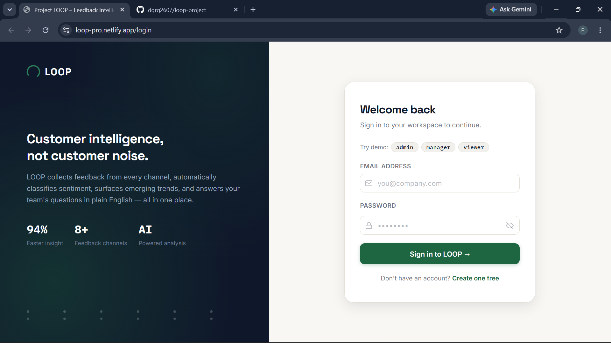
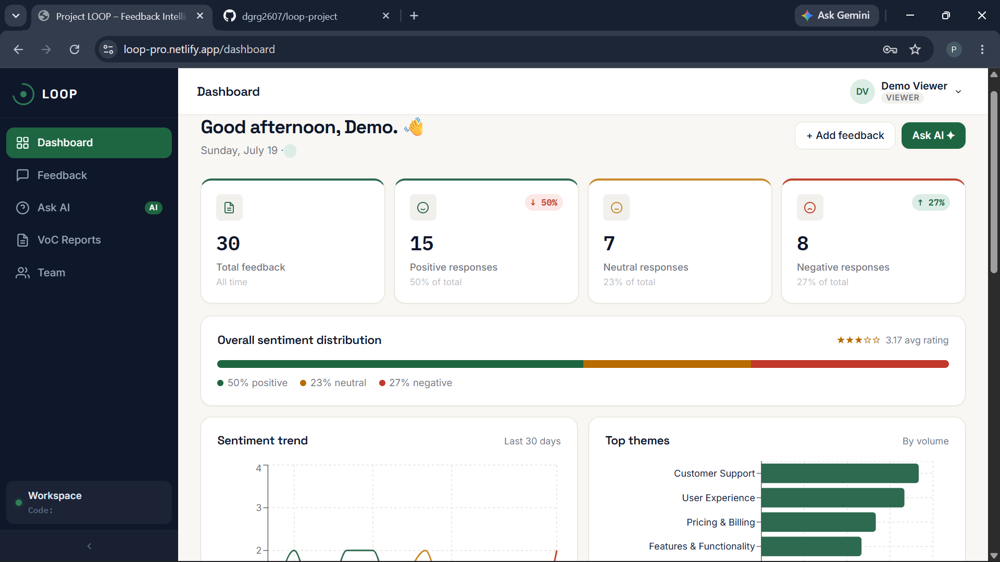
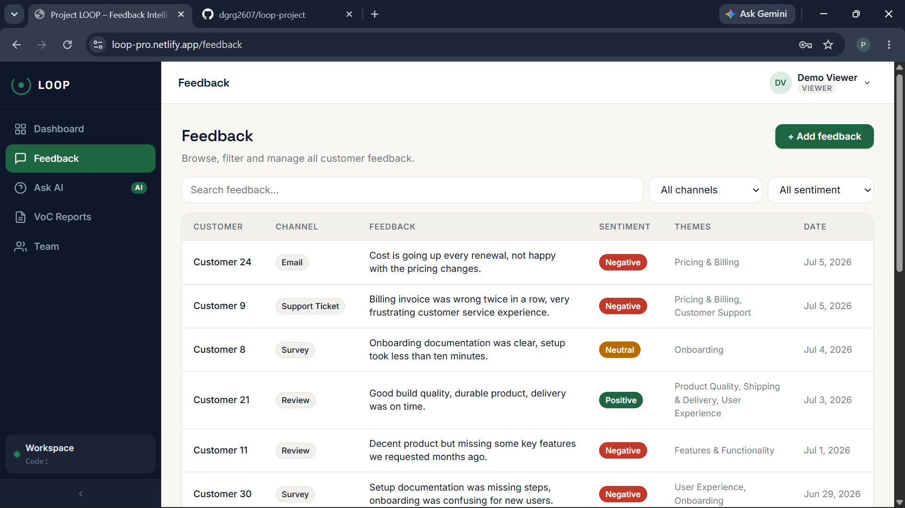
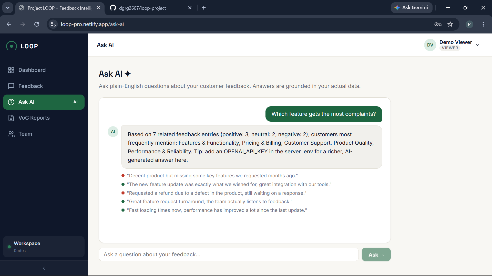
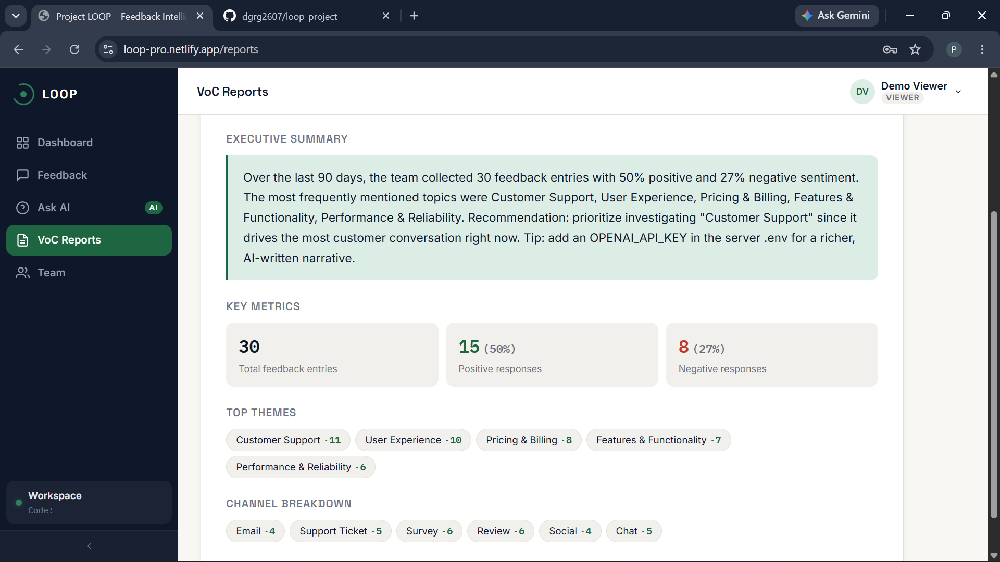
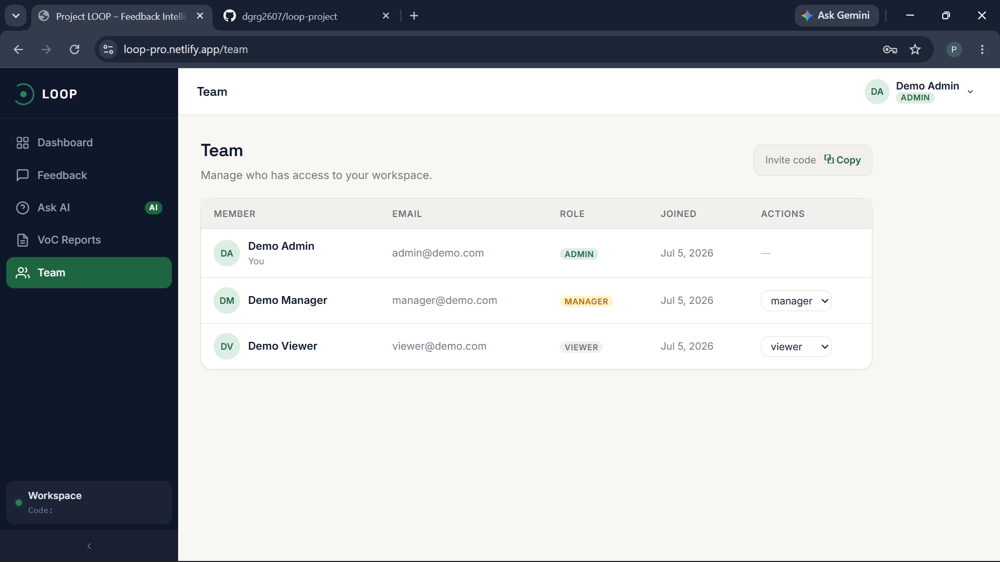

# Project LOOP — AI Customer Feedback Intelligence Platform

**Project LOOP** is a full-stack, multi-tenant SaaS platform that helps businesses collect, analyze, and act on customer feedback. It automatically classifies sentiment, detects recurring themes and emerging trends, answers natural-language questions about your feedback data, and generates Voice-of-Customer (VoC) executive reports — all in one place.

## 🚀 Live Demo

- **Frontend**: [https://loop-pro.netlify.app/](https://loop-pro.netlify.app/)
- **Backend API**: [https://loop-project-rqkr.onrender.com/api/health](https://loop-project-rqkr.onrender.com/api/health)

**Demo Credentials:**

| Role | Email | Password |
|------|-------|----------|
| Admin | admin@demo.com | password123 |
| Manager | manager@demo.com | password123 |
| Viewer | viewer@demo.com | password123 |

## ✨ Features

- **Multi-tenant Data Model** — Every user and feedback record belongs to an Organization. Data is completely isolated between tenants.
- **Role-Based Access Control** — Admin, Manager, and Viewer roles with different permissions.
- **Sentiment Classification** — Automatic positive/neutral/negative scoring using lexicon-based analysis (works offline, no API key required).
- **Theme Detection** — Automatically categorizes feedback into 8 themes: Pricing, Support, Shipping, UX, Performance, Features, Onboarding, Quality.
- **Emerging Trend Detection** — Compares theme frequency between the last 7 days and the previous 7 days to flag topics that are suddenly spiking.
- **Analytics Dashboard** — Sentiment trend line chart, top-themes bar chart, channel breakdown pie chart, and live metric cards.
- **AI Q&A ("Ask AI")** — Ask plain-English questions; the API retrieves relevant feedback and answers using it (OpenAI optional, rule-based fallback included).
- **Automated VoC Reports** — Generate stats-backed executive summaries for any time window (7/30/90 days).
- **Multi-channel Feedback Intake** — Email, chat, survey, social, review, support ticket.
- **Team Management** — Invite team members via shareable invite codes and manage roles.

## 🛠️ Tech Stack

### Frontend
- **React 18.3.1** — UI library
- **React Router DOM 6** — Client-side routing
- **Vite 5** — Build tool and development server
- **Recharts** — Data visualization library
- **Axios** — HTTP client
- **CSS** — Custom design system with CSS variables

### Backend
- **Node.js 18+** — Runtime environment
- **Express 4.19.2** — Web framework
- **MongoDB** — Database with Mongoose ODM
- **JWT** — Authentication with bcrypt password hashing
- **Sentiment** — Lexicon-based sentiment analysis (offline)
- **OpenAI API** — Optional AI integration (GPT-4o-mini)
- **Helmet, CORS, Rate Limiting** — Security middleware

### Deployment
- **Frontend**: Netlify
- **Backend**: Render
- **Database**: MongoDB Atlas

## 📁 Project Structure

```
project-loop/
├── client/                      # React frontend
│   ├── src/
│   │   ├── api/                 # Axios configuration
│   │   ├── components/          # Reusable UI components
│   │   │   ├── Layout.jsx       # Main app shell with sidebar
│   │   │   ├── ProtectedRoute.jsx
│   │   │   ├── ChannelPieChart.jsx
│   │   │   ├── SentimentTrendChart.jsx
│   │   │   ├── ThemeBarChart.jsx
│   │   │   ├── FeedbackTable.jsx
│   │   │   ├── FeedbackFormModal.jsx
│   │   │   ├── Pagination.jsx
│   │   │   ├── Skeleton.jsx
│   │   │   └── GlobalErrorListener.jsx
│   │   ├── context/             # React Context providers
│   │   │   ├── AuthContext.jsx
│   │   │   └── ToastContext.jsx
│   │   ├── hooks/               # Custom React hooks
│   │   │   ├── useFetch.js      # SWR-style data fetching with caching
│   │   │   └── useDebounce.js
│   │   ├── pages/               # Page components
│   │   │   ├── Login.jsx
│   │   │   ├── Register.jsx
│   │   │   ├── Dashboard.jsx
│   │   │   ├── Feedback.jsx
│   │   │   ├── AskAI.jsx
│   │   │   ├── Reports.jsx
│   │   │   └── Team.jsx
│   │   ├── App.jsx
│   │   ├── main.jsx
│   │   └── index.css            # Global styles & design system
│   ├── index.html
│   ├── package.json
│   ├── vite.config.js
│   └── netlify.toml
│
├── server/                      # Express + MongoDB API
│   ├── config/
│   │   └── db.js                # MongoDB connection
│   ├── models/                  # Mongoose schemas
│   │   ├── Organization.js
│   │   ├── User.js
│   │   └── Feedback.js
│   ├── middleware/
│   │   ├── auth.js              # JWT authentication
│   │   ├── role.js              # Role-based access control
│   │   ├── validate.js          # Input validation
│   │   └── errorHandler.js      # Global error handler
│   ├── controllers/             # Business logic
│   │   ├── authController.js
│   │   ├── feedbackController.js
│   │   ├── analyticsController.js
│   │   ├── aiController.js
│   │   └── userController.js
│   ├── routes/                  # API routes
│   │   ├── authRoutes.js
│   │   ├── feedbackRoutes.js
│   │   ├── analyticsRoutes.js
│   │   ├── aiRoutes.js
│   │   └── userRoutes.js
│   ├── utils/                   # Utility functions
│   │   ├── sentiment.js         # Sentiment analysis
│   │   ├── themes.js            # Theme extraction
│   │   ├── aiClient.js          # OpenAI integration
│   │   ├── cache.js             # In-memory TTL cache
│   │   ├── ApiError.js          # Custom error class
│   │   └── asyncHandler.js      # Async error wrapper
│   ├── seed/
│   │   └── seed.js              # Database seeder
│   ├── server.js                # App entry point
│   ├── package.json
│   └── .env.example
│
├── package.json                 # Root package.json (concurrently)
└── README.md
```

## 🏗️ Architecture Summary

### Data Flow

```
┌─────────────────────────────────────────────────────────────────┐
│                      Client (React SPA)                        │
│  ┌─────────┐  ┌──────────┐  ┌──────────┐  ┌──────────────┐   │
│  │ Login/  │  │Dashboard │  │Feedback  │  │  Ask AI /    │   │
│  │Register │  │          │  │Management│  │  Reports     │   │
│  └────┬────┘  └────┬─────┘  └────┬─────┘  └──────┬───────┘   │
│       │            │             │               │            │
│       └────────────┴─────────────┴───────────────┘            │
│                            │                                   │
│                   ┌────────▼────────┐                         │
│                   │   Axios Client  │                         │
│                   │ (JWT Interceptor)│                         │
│                   └────────┬────────┘                         │
└────────────────────────────┼──────────────────────────────────┘
                             │ HTTPS
                             ▼
┌─────────────────────────────────────────────────────────────────┐
│                   Express API Server                           │
│  ┌──────────────────────────────────────────────────────────┐  │
│  │              Middleware Stack                            │  │
│  │  CORS → Helmet → Compression → JSON → Rate Limiter      │  │
│  └──────────────────────────────────────────────────────────┘  │
│                             │                                   │
│  ┌───────────┐  ┌──────────┴──────────┐  ┌──────────────┐    │
│  │ /api/auth │  │ /api/feedback        │  │ /api/analytics│   │
│  │ Login     │  │ CRUD + bulk delete   │  │ Overview     │   │
│  │ Register  │  │ CSV export           │  │ Sentiment    │   │
│  │ Me        │  │                      │  │ Themes       │   │
│  └───────────┘  └──────────┬──────────┘  │ Channels     │   │
│                             │              │ Trends       │   │
│  ┌───────────┐  ┌──────────┴──────────┐  └──────────────┘    │
│  │ /api/ai   │  │ /api/users          │  ┌──────────────┐    │
│  │ Ask       │  │ List team           │  │  /api/health │    │
│  │ VoC Report│  │ Update role         │  │  Check       │    │
│  └───────────┘  └─────────────────────┘  └──────────────┘    │
│                             │                                   │
│                   ┌────────▼────────┐                         │
│                   │   Controllers   │                         │
│                   │ (Business Logic)│                         │
│                   └────────┬────────┘                         │
└────────────────────────────┼──────────────────────────────────┘
                             │
                             ▼
┌─────────────────────────────────────────────────────────────────┐
│                    MongoDB Atlas                                │
│  ┌──────────────┐  ┌──────────┐  ┌────────────────────────┐  │
│  │ Organizations│  │  Users   │  │      Feedback          │  │
│  │ _id          │  │ _id      │  │  _id                   │  │
│  │ name         │  │ name     │  │  organization          │  │
│  │ inviteCode   │  │ email    │  │  text                  │  │
│  └──────────────┘  │ password │  │  channel              │  │
│                    │ role     │  │  rating               │  │
│                    │ org      │  │  sentiment {score,    │  │
│                    └──────────┘  │    label}             │  │
│                                  │  themes: []           │  │
│                                  │  createdAt            │  │
│                                  └────────────────────────┘  │
└─────────────────────────────────────────────────────────────────┘
```

### Key Architecture Decisions

1. **Multi-tenancy**: Every document is scoped to an `organization` field, ensuring complete data isolation between tenants.

2. **Caching Strategy**: In-memory TTL cache (30 seconds) for expensive aggregation pipelines, automatically invalidated on writes.

3. **Offline Sentiment Analysis**: Uses the `sentiment` npm package for lexicon-based scoring — works without any API key.

4. **Optional AI Integration**: OpenAI API is optional; if no key is provided, the system falls back to rule-based summaries using real data.

5. **Role-Based Access Control**: Three roles (admin, manager, viewer) with different permissions for feedback deletion and user management.

6. **Lazy Loading**: React pages are code-split using `React.lazy` for optimal initial load performance.

7. **SWR-style Data Fetching**: The `useFetch` hook implements stale-while-revalidate pattern for instant navigation.

### API Endpoints Overview

| Method | Endpoint | Description | Access |
|--------|----------|-------------|--------|
| POST | `/api/auth/register` | Create new user/workspace | Public |
| POST | `/api/auth/login` | User login | Public |
| GET | `/api/auth/me` | Get current user | Auth |
| POST | `/api/feedback` | Create feedback entry | Auth |
| GET | `/api/feedback` | List feedback (filtered/paginated) | Auth |
| DELETE | `/api/feedback/:id` | Delete feedback | Admin/Manager |
| POST | `/api/feedback/bulk-delete` | Bulk delete | Admin/Manager |
| GET | `/api/feedback/export.csv` | Export CSV | Auth |
| GET | `/api/analytics/overview` | Dashboard metrics | Auth |
| GET | `/api/analytics/sentiment-trend` | Daily sentiment trend | Auth |
| GET | `/api/analytics/themes` | Top themes | Auth |
| GET | `/api/analytics/channels` | Channel distribution | Auth |
| GET | `/api/analytics/trends` | Emerging trends | Auth |
| POST | `/api/ai/ask` | AI Q&A | Auth |
| GET | `/api/ai/voc-report` | VoC report | Auth |
| GET | `/api/users` | List team members | Auth |
| PATCH | `/api/users/:id/role` | Update user role | Admin |

## 📸 Screenshots

### Login Page



### Dashboard



### Feedback Management



### Ask AI



### VoC Reports



### Team Management



## 🚀 Local Setup Instructions

### Prerequisites

- Node.js 18 or newer
- MongoDB (local or MongoDB Atlas account)
- Git

### Step 1: Clone the Repository

```bash
git clone https://github.com/dgrg2607/loop-project.git
cd loop-project
```

### Step 2: Install Dependencies

```bash
# Install root dependencies (concurrently)
npm install

# Install client dependencies
cd client && npm install

# Install server dependencies
cd ../server && npm install

# Return to root
cd ..
```

### Step 3: Configure Environment Variables

**Backend (server/):**
```bash
cp server/.env.example server/.env
```

Open `server/.env` and set the following variables:

```env
PORT=5000
HOST=0.0.0.0
NODE_ENV=development

# MongoDB Connection
MONGO_URI=mongodb+srv://<username>:<password>@cluster0.j95knif.mongodb.net/loop?retryWrites=true&w=majority

# JWT Authentication
JWT_SECRET=your-super-secret-jwt-key-change-this-in-production
JWT_EXPIRES_IN=7d

# Client URL (for CORS)
CLIENT_URL=http://localhost:5173

# OpenAI (Optional)
OPENAI_API_KEY=your-api-key-here
OPENAI_MODEL=gpt-4o-mini
```

**Frontend (client/):**
```bash
cp client/.env.example client/.env
```

Open `client/.env`:
```env
VITE_API_URL=http://localhost:5000/api
```

### Step 4: Seed the Database

```bash
cd server
npm run seed
```

This creates:
- Demo organization "Acme Corp (Demo)"
- 3 demo users (admin, manager, viewer)
- 30 sample feedback entries spread across the last 30 days

### Step 5: Run the Application

**Option A: Run both client and server together (recommended):**

```bash
# From the project root
npm run dev
```

- Frontend: http://localhost:5173
- Backend: http://localhost:5000
- Health check: http://localhost:5000/api/health

**Option B: Run separately:**

```bash
# Terminal 1 - Backend
cd server
npm run dev

# Terminal 2 - Frontend
cd client
npm run dev
```

### Step 6: Log In

Open http://localhost:5173 and log in with one of the demo accounts:

| Email | Password | Role |
|-------|----------|------|
| admin@demo.com | password123 | Admin |
| manager@demo.com | password123 | Manager |
| viewer@demo.com | password123 | Viewer |

## 🗄️ Database Commands

### Seed the Database

```bash
cd server
npm run seed
```
This wipes existing data and creates fresh demo data.

### Test Database Connection

```bash
cd server
npm run test:db
```
Checks if MongoDB is reachable and lists available collections.

## 🌐 Deployment

### Deploy Backend to Render

1. Push your code to GitHub
2. Go to [Render](https://render.com) and create a new Web Service
3. Connect your repository
4. Set the following:
   - **Environment**: Node
   - **Build Command**: `npm install`
   - **Start Command**: `npm start`
5. Add environment variables:
   - `MONGO_URI`
   - `JWT_SECRET`
   - `CLIENT_URL` (your Netlify URL)

### Deploy Frontend to Netlify

1. Push your code to GitHub
2. Go to [Netlify](https://netlify.com) and create a new site from Git
3. Set the following:
   - **Build Command**: `npm run build`
   - **Publish Directory**: `dist`
4. Add environment variable:
   - `VITE_API_URL` = your Render backend URL + `/api`

### Environment Variables Summary

| Variable | Where | Purpose |
|----------|-------|---------|
| `MONGO_URI` | Render | MongoDB connection string |
| `JWT_SECRET` | Render | JWT signing key |
| `JWT_EXPIRES_IN` | Render | Token expiry (default: 7d) |
| `CLIENT_URL` | Render | CORS allowed origin |
| `OPENAI_API_KEY` | Render (optional) | OpenAI API key |
| `OPENAI_MODEL` | Render (optional) | AI model (default: gpt-4o-mini) |
| `VITE_API_URL` | Netlify | Backend API URL |

## 📝 License

This project is open-source and available under the MIT License.

## 🤝 Contributing

1. Fork the repository
2. Create a feature branch (`git checkout -b feature/amazing-feature`)
3. Commit your changes (`git commit -m 'Add amazing feature'`)
4. Push to the branch (`git push origin feature/amazing-feature`)
5. Open a Pull Request

## 📧 Contact

For questions or support, please open an issue on the GitHub repository.

---

**Built with ❤️ using React, Express, and MongoDB**